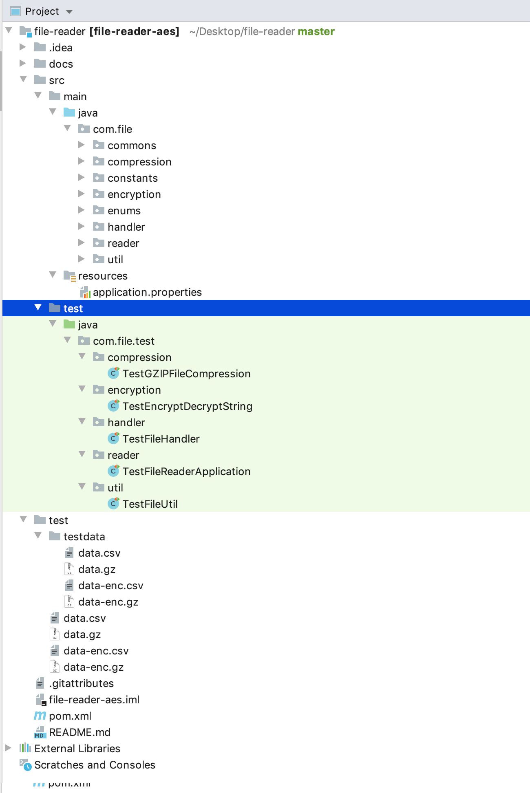

# File-reader
This is design of a generic File based reader which supports reading data and handles encoding, decryption & decompression based on user configuration.

This project is written in core java without using any frameworks.

## Taking file properties as input
### CharSet :

Charset with which the file data (binary) is encoded with. For example ISO-8859-1 is used to convert ISO Latin Alphabet string to binary for writing into file.

In case if this property is not specified then the bytes (Update: File is encoded with UTF-8) are encoded with UTF-8 is considered.

### Encryption :

AES Encryption algorithm is used for encrypting the data before writing to file. If not specified, then there is no encryption and the data will be persisted as plain text.

### Compression:

Compression logic is used to compress the data before writing to file. Possible values are gzip, (yet to implement bzip, bz etc). In case is user has not specified, then the data is uncompressed.

Classes are designed with respective methods to read files and perform the operation specified and return the plain text to the caller.

Also unit tests are covered as well.

## Architecturing the file reader

The project directory:

## Test the file reader
The test directory:

# Execution

- Clone the project
- Import the project into your IDE. I used IntelliJ
- Modify the settings accordingly
- Ensure that the project is artifacted with Java 1.8 in all preferences or in settings
- Create a temp folder for the logs and update the path in the ApplicationConstant.java file at LOG_PATH variable
- Do a Maven (Clean, package/install) and let all the dependencies be available
- If any issues in pom.xml regaarding the versions then upgrade them and try again
- Once build is done then either create a Run config in your IDE or type the command from terminal/CMD

### Usage 1`
- `>> FileReaderApplication data.csv ENC_AES128 COM_GZIP` _ENC = encrypt, COM = compression_
  - Here compression and encryption modules are loaded since user specified both the options. It means, data is decompressed first, decrypted and parsed as CSV record

### Usage 2
- `>> FileReaderApplication data.csv COM_GZIP` _COM = compression_
  - Here compression module is loaded since user specifieed compression only. It means, data is decompressed and parsed as CSV record

### Usage 3
- `>> FileReaderApplication data.csv ENC_AES128` _ENC = encrypt_
  - Here encryption module is loaded since user specify encryption only. It means, data is decrypted and parsed as CSV record

### Usage 4
- `>> FileReaderApplication data.csv`

No option is specified. It means, data is read and parsed as CSV record
